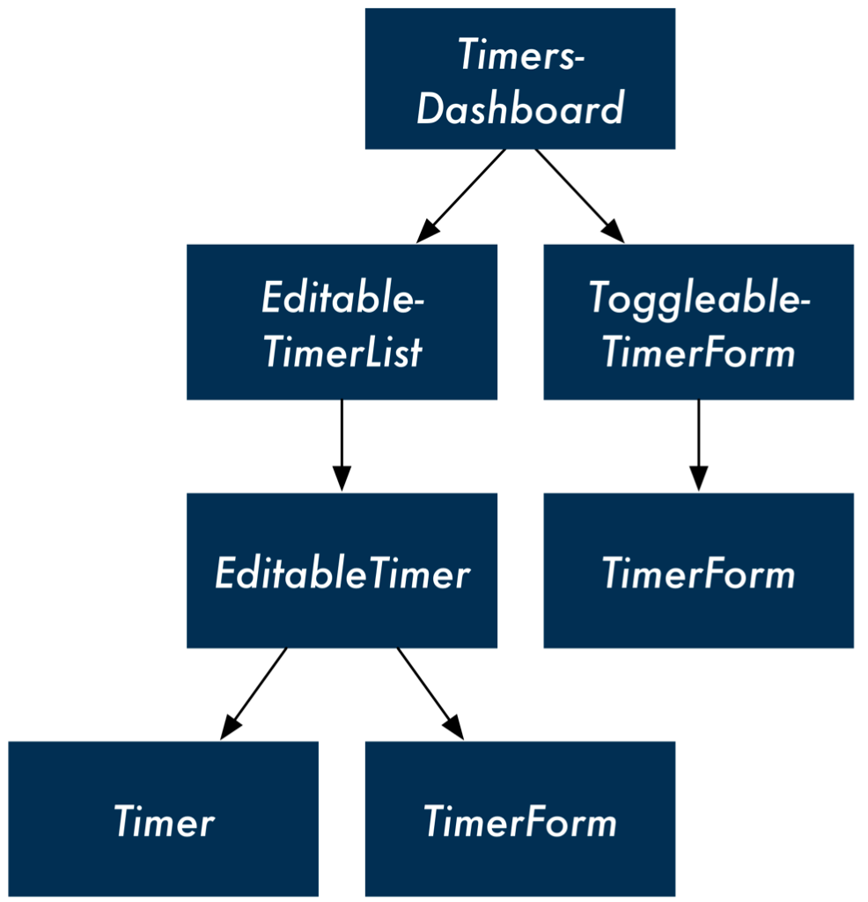

# CH2 - COMPONENTS
---

## 1. A time logging app - Intro
- We investigate a pattern that you can use to build React apps from scratch and then put those steps to work to build an interface for managing timers.

#### #1.1. BREAKING THE APP INTO COMPONENTS

- However, there’s one **subtle difference**: This list of timers has a little **“+” icon** at the bottom. As we saw, we’re able to add new timers to the list using this button.
- So, in reality, the TimerList component isn’t just a list of timers. **It also contains a widget** to create new timers.
- A component should, ideally, **only be responsible for one piece of functionality**
- So, the proper response here is for us to **shrink TimerList back into its responsibility of just listing timers and to nest it under a parent component.** 
- We’ll call the parent **TimersDashboard**. TimersDashboard **will have TimerList** and the **“+”/create form widget as children**:

- The “+”/create form widget is interesting because it has two distinct representations. When the “+” button is clicked, the widget transmutes into a form. When the form is closed, the widget transmutes back into a “+” button.
- We’ll call it **ToggleableTimerForm**. As a child, it can either render the component TimerForm or the HTML markup for the “+” button.
---
- The timer itself has a fair bit of functionality. It can **transform into an edit form, delete itself, and start and stop itself**. 
- Do we need to break this up? And if so, how?
- **Displaying a timer and editing a timer are indeed two distinct UI elements**. 
- We need some container component that **renders either the timer’s face or its edit form depending on if the timer is being edited**.
- We’ll call this **EditableTimer**. 
- The c**hild of EditableTimer** will then be either **a Timer component** or **the edit form component**. 
- The form for creating and editing timers is very similar, so let’s assume that we can use the component TimerForm in both contexts:

---
- So, we have our final component hierarchy, with some ambiguity around the final
state of the timer component:

- **TimersDashboard**: Parent container
  - **EditableTimerList**: Displays a list of timer containers
    - **EditableTimer**: Displays either a timer or a timer’s edit form 
      - **Timer**: Displays a given timer
      - **TimerForm**: Displays a given timer’s edit form
  - **ToggleableTimerForm**: Displays a form to create a new timer
    - **TimerForm** (not displayed): Displays a new timer’s create form

- Represented as a hierarchical tree:

---
  
## 2. The steps for building React apps from scratch
- Ultimately, our **top-level component** will **communicate** with a **server**. 
- The **server will be the initial source of state**, and React will render itself according to the data the server provides. 
- Our app will also **send updates to the server**, *like when a timer is started*:

### !!React framework for developing a React app from scratch:
1. Break the app into components
2. Build a static version of the app
3. Determine what should be stateful
4. Determine in which component each piece of state should live 5. Hard-code initial states
6. Add inverse data flow
7. Add server communication

- We’ve already covered **step (1)** and **have a good understanding of all of our components**, save for some uncertainty down at the Timer component.
---

